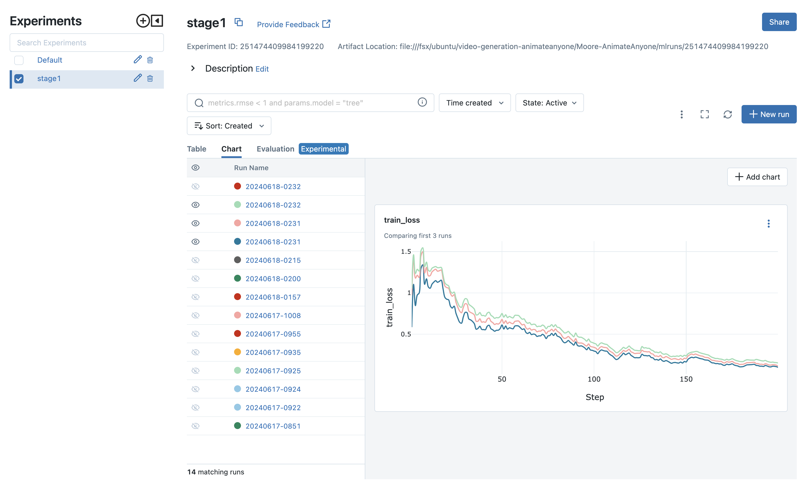

## SageMaker Hyperpod Cluster Creation and AnimateAnyone training Guide


This guide provides instructions for creating and managing a SageMaker Hyperpod cluster, as well as implementing the AnimateAnyone algorithm. It is based on the [SageMaker Hyperpod workshop studio guidance](https://catalog.workshops.aws/sagemaker-hyperpod/en-US) and the [Moore-AnimateAnyone repository](https://github.com/MooreThreads/Moore-AnimateAnyone).

## Table of Contents

1. [Cluster Creation](#cluster-creation)
2. [Cluster Access](#cluster-access)
3. [Running AnimateAnyone](#running-animateanyone)
4. [Additional Resources](#additional-resources)

## Cluster Creation

### Lifecycle Scripts

Lifecycle scripts allow customization of your cluster during creation. They can be used to:
- Install software packages
- Set up configurations
- Configure Slurm
- Create users
- Install Conda or Docker

To set up lifecycle scripts:

1. Clone the repository and upload scripts to S3:
   ```bash
   git clone --depth=1 https://github.com/aws-samples/awsome-distributed-training/
   cd awsome-distributed-training/1.architectures/5.sagemaker-hyperpod/LifecycleScripts/
   aws s3 cp --recursive base-config/ s3://${BUCKET}/src
   ```

### Cluster Configuration

1. Prepare `cluster-config.json` and `provisioning_parameters.json` files.
2. Upload the configuration to S3:
   ```bash
   aws s3 cp provisioning_parameters.json s3://${BUCKET}/src/
   ```
3. Create the cluster:
   ```bash
   aws sagemaker create-cluster --cli-input-json file://cluster-config.json --region $AWS_REGION
   ```

Example of [`cluster-config.json` and `provisioning_parameters.json` can be found at  in ClusterConfig](./ClusterConfig)

 
### Scaling the Cluster

To increase worker instances:

1. Update `cluster-config.json` with the new instance count.
2. Run:
   ```bash
   aws sagemaker update-cluster \
    --cluster-name ${my-cluster-name} \
    --instance-groups file://update-cluster-config.json \
    --region $AWS_REGION
   ```

Example of [`update-cluster-config.json` can be found at  in ClusterConfig](./ClusterConfig)


### Shutting Down the Cluster

```bash
aws sagemaker delete-cluster --cluster-name ${my-cluster-name}
```

### Notes

- SageMaker HyperPod supports Amazon FSx for Lustre integration, enabling [full bi-directional synchronization with Amazon S3](https://aws.amazon.com/blogs/aws/enhanced-amazon-s3-integration-for-amazon-fsx-for-lustre/).
- Ensure proper AWS CLI permissions and configurations.
- Review and test configurations before production deployment.
- Monitor cluster usage for cost and performance optimization.

## Cluster Access

Follow the guidance on [Accessing SageMaker HyperPod cluster nodes](https://docs.aws.amazon.com/sagemaker/latest/dg/sagemaker-hyperpod-run-jobs-access-nodes.html).

### SSH into Controller Node

```bash
./easy-ssh.sh -c controller-machine ml-cluster
sudo su - ubuntu
```

For VS Code connection, follow [this guide](https://catalog.us-east-1.prod.workshops.aws/workshops/e3752eec-63b5-4033-9720-fa68d35164e9/en-US/05-advanced/05-vs-code) to set up an SSH Proxy via SSM.

### SSH into Worker Node

First-time login to the controller node:

```bash
cd ~/.ssh
ssh-keygen -t rsa -q -f "$HOME/.ssh/id_rsa" -N ""
cat id_rsa.pub >> authorized_keys
```

Allocate and access a worker node:

```bash
salloc -N 1
ssh $(srun hostname)
```

### Install Miniconda (on worker node)

```bash
wget https://repo.anaconda.com/miniconda/Miniconda3-latest-Linux-x86_64.sh
chmod +x Miniconda3-latest-Linux-x86_64.sh
./Miniconda3-latest-Linux-x86_64.sh -b -f -p ~/miniconda3
source ~/miniconda3/bin/activate
conda create -n videogen python=3.10
conda activate videogen
```

### Useful Slurm Commands

- List partitions and nodes: `sinfo`
- List queued/running jobs: `squeue`

## Running AnimateAnyone

Based on the [Moore-AnimateAnyone repository](https://github.com/MooreThreads/Moore-AnimateAnyone).

### Setup

1. Activate the conda environment:
   ```bash
   source ~/miniconda3/bin/activate
   conda activate videogen
   ```

2. Install required packages:
   ```bash
   pip install -r requirements.txt
   ```

3. Download pre-trained weights:
   ```bash
   python tools/download_weights.py
   ```

4. Test the training script:
   ```bash
   accelerate launch train_stage_1.py --config configs/train/stage1.yaml
   accelerate launch train_stage_2.py --config configs/train/stage2.yaml
   ```

### Running Experiments

#### Single Node Job

The detailed instructions can be found in [here](./AlgoSlurm) 

```bash
sbatch submit-animateanyone-algo.sh
```

Note: For smaller GPU instances (e.g., G5 2xlarge), adjust `train_bs: 2` and `train_width: 256 train_height: 256 ` to avoid out-of-memory issues. [See one configuration example in AlgoSlurm](./AlgoSlurm)

#### Hyperparameter Testing
```bash
sbatch submit-hyperparameter-testing.sh
```


#### Multi-Node Job with DeepSpeed

The detailed instructions can be found in [here](./DeepSpeedDistributed) 

The folder contains the single node multi-GPUs setup, as well as the multi-mode multi-GPUs Slurm launch file. 

### Monitoring Experiments

Use MLflow for visualization:

```bash
mlflow ui --backend-store-uri ./mlruns/
```




## Additional Resources

Recent advancements in video generation have rapidly overcome limitations of earlier models like Animate Anyone. Two notable research papers showcase significant progress in this domain:
- Champ: Controllable and Consistent Human Image Animation with 3D Parametric Guidance enhances shape alignment and motion guidance. It demonstrates superior ability in generating high-quality human animations that accurately capture both pose and shape variations, with improved generalization on in-the-wild datasets.
- UniAnimate: Taming Unified Video Diffusion Models for Consistent Human Image Animation enables the generation of longer videos, up to one minute, compared to earlier models' limited frame outputs. It introduces a unified noise input supporting both random noised input and first frame conditioned input, enhancing long-term video generation capabilities.

As research in this field rapidly progresses, SageMaker Hyperpod prove invaluable for AI research and experimentation. It provides the necessary computational resources and flexibility to quickly implement and test innovative ideas, accelerating advancements in video generation and related AI technologies. SageMaker Hyperpod's scalable infrastructure allows researchers to efficiently train and fine-tune large models, reducing the time from concept to implementation. Its integrated development environment streamlines the workflow, enabling faster iterations and more comprehensive experiments. By leveraging such advanced cloud computing solutions, researchers can push the boundaries of what's possible in video generation, potentially leading to breakthroughs in areas like virtual reality, film production, and interactive digital media.


- [Original Moore-AnimateAnyone Repository](https://github.com/MooreThreads/Moore-AnimateAnyone)
- [SageMaker Hyperpod Workshop Studio](https://catalog.workshops.aws/sagemaker-hyperpod/en-US)
- [Animate Anyone: Consistent and Controllable Image-to-Video Synthesis for Character Animation](https://arxiv.org/abs/2311.17117)
- [Champ: Controllable and Consistent Human Image Animation with 3D Parametric Guidance](https://arxiv.org/abs/2403.14781)
- [UniAnimate: Taming Unified Video Diffusion Models for Consistent Human Image Animation](https://arxiv.org/abs/2406.01188)

## Notes

- Ensure proper GPU resources and CUDA setup before running experiments.
- Adjust batch files and configurations as needed for your environment.
- Regularly check the original repository for updates or changes.


## Security

See [CONTRIBUTING](CONTRIBUTING.md#security-issue-notifications) for more information.

## License

This library is licensed under the MIT-0 License. See the LICENSE file.

