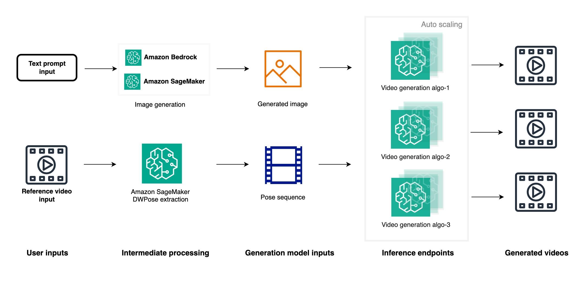

# Video Generation Model deployment on SageMaker
When the fine-tuned model is ready, you have two primary deployment options: using popular image/video generation GUIs like [ComfyUI](https://github.com/comfyanonymous/ComfyUI), or deploying an inference endpoint with Amazon SageMaker. The SageMaker option offers several advantages, including easy integration of image generation APIs with video generation endpoints to create end-to-end pipelines. As a managed service with autoscaling, SageMaker enables parallel generation of multiple videos using either the same reference image with different reference videos or vice versa. Furthermore, you can deploy various video generation model endpoints such as [MimicMotion](https://github.com/Tencent/MimicMotion) and [UniAnimate](https://github.com/ali-vilab/UniAnimate), allowing for quality comparisons by generating videos in parallel with the same reference image and video. This approach not only provides flexibility and scalability but also accelerates the production process by enabling the generation of a large number of videos quickly, ultimately streamlining the process of obtaining content that meets business requirements. The SageMaker option thus offers a powerful, efficient, and scalable solution for video generation workflows.

## Architecture

## Inference with the fine-tuned or pretrained model
To evaluate the performance of your fine-tuned or pretrained model, follow these steps:

1. Quick Check:
   Run [inference_local.ipynb](./inference_local.ipynb) to generate a test video and perform an initial assessment.
2. Creating a Video Generation Pipeline:
   After the initial check, set up the following endpoints:
   - Pose Extraction Endpoint:
      - Purpose: Extract pose sequences from reference videos
      - How: Run [inference-byoc-dwpose.ipynb](./inference-byoc-dwpose.ipynb)
      - Type: Real-time endpoint
   - Video Generation Endpoint:
      - Purpose: Generate videos using reference images and pose sequence videos
      - How: Run [animateanyone-inference.ipynb](./animateanyone-inference.ipynb)
      - Type: Asynchronous endpoint
   - Integrated Pipeline:
      - Purpose: Combine Amazon Bedrock's image generation API with the SageMaker video generation endpoint
      - How: Run [video_generation_pipeline.ipynb](./video_generation_pipeline.ipynb)

This setup allows for a comprehensive video generation workflow, from pose extraction to final video output, leveraging both Amazon Bedrock and SageMaker services.